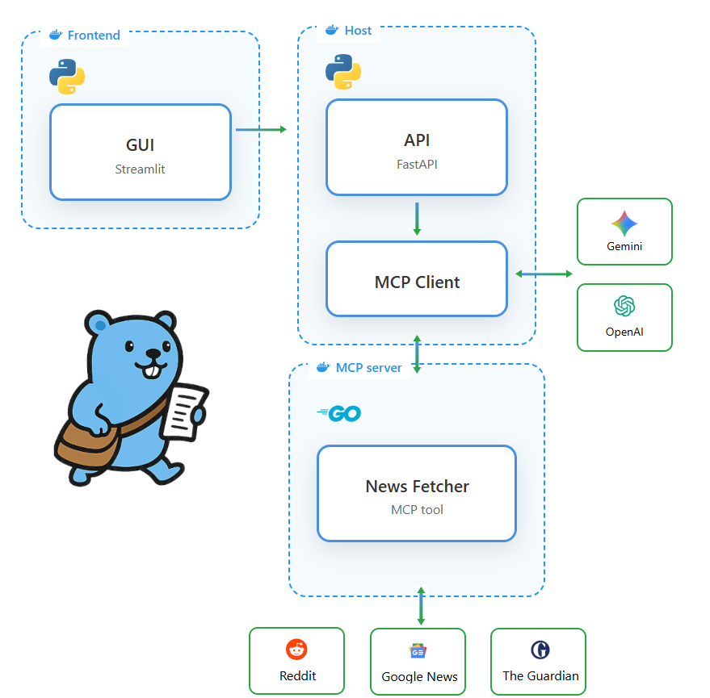

    

# DailyFetch

DailyFetch is an AI-powered news assistant. It collects, analyzes, and summarizes the latest news from different sources and for different categories.  
It delivers a clean and personalized daily briefing, saving you from information overload.

## Features

- Fetches news from multiple sources  
- Uses AI to generate concise and insightful summaries  
- Returns a daily digest in a clean, readable format  
- Simple setup, flexible configuration  
- Architecture designed for extensibility

## Architecture

    

Dailyfetch is built on top of the **Model Context Protocol (MCP)** for modularity and interoperability.  

The system runs as three Docker containers:

1. **Frontend** → A Streamlit app for browsing and interacting with your daily digest  
2. **MCP Host, Client and API** → FastAPI service exposing the MCP agent interface  
3. **MCP Server** → An MCP tool that concurrently retrieves news from multiple site  

Key technologies:

- **Python** → APIs, agent host and orchestration  
- **Go** → MCP tools for high-performance news data fetching  
- **Cloud AI APIs** → Integrates with **OpenAI** and **Google Gemini** for summarization and reasoning  

Dailyfetch can be used in two ways:
- As an **API** (via FastAPI)  
- Through the **Streamlit frontend** for a user-friendly experience  

## License

This project is licensed under the **MIT License**.